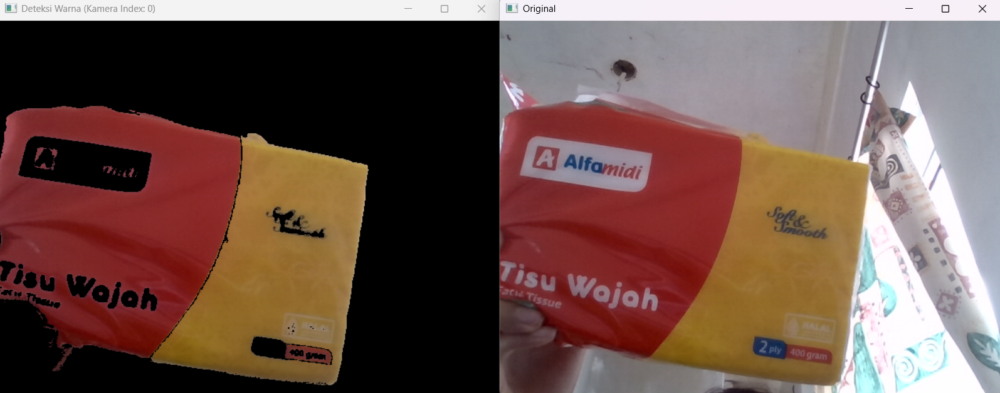

# Deteksi Warna Real-Time dengan OpenCV & Python

Script sederhana untuk deteksi objek berdasarkan warna (merah dan kuning) secara real-time dari kamera. Dibuat dengan **Python** dan **OpenCV**.

---

## ⚙️ Instalasi & Setup

Ikuti langkah-langkah ini untuk menyiapkan *environment* dan dependensi yang diperlukan.

1.  **Download & Ekstrak Proyek**
    Buka halaman utama repository ini di GitHub. Klik tombol hijau **`< > Code`**, lalu pilih **`Download ZIP`**. Setelah selesai di-download, ekstrak file ZIP tersebut di lokasi yang inginkan.

    > **Untuk Pengguna Git:** Alternatifnya,nbisa clone repository ini langsung via terminal:
    > `git clone https://github.com/username/nama-repo.git`

2.  **Masuk ke Folder Proyek**
    Buka terminal atau Command Prompt, lalu navigasi ke dalam folder hasil ekstrak tadi.
    ```bash
    # Contoh: cd Downloads/nama-repo-main
    cd path/ke/folder-proyek
    ```

3.  **Buat Virtual Environment**
    Di dalam folder project, jalankan perintah ini untuk membuat *virtual environment* bernama `venv`:
    ```bash
    python -m venv venv
    ```

4.  **Aktifkan Virtual Environment**
    Aktivasi environment yang baru dibuat. Perintahnya berbeda tergantung sistem operasi yang dipakai.

    * **Untuk Windows (CMD/PowerShell):**
        ```bash
        venv\Scripts\activate
        ```

    * **Untuk macOS & Linux (Bash/Zsh):**
        ```bash
        source venv/bin/activate
        ```
    > Setelah aktif, nama environment `(venv)` akan muncul di awal baris terminal.

5.  **Install Dependencies**
    Terakhir, install semua library yang dibutuhkan dari file `requirements.txt` dengan satu perintah:
    ```bash
    pip install -r requirements.txt
    ```
    Gampang kan? Sekarang project siap dijalankan!

---

## 🚀 Cara Menjalankan Script

1.  Pastikan *virtual environment* **sudah aktif**.
2.  Jalankan script `main.py` melalui terminal:
    ```bash
    python main.py
    ```
3.  Script akan otomatis mencoba mengakses kamera pada **index 0** (biasanya webcam internal laptop).
4.  Beberapa jendela akan muncul menampilkan feed kamera asli dan hasil deteksi warnanya.
5.  Untuk keluar dari program, tekan tombol **`Esc`** pada keyboard.

> **📝 Catatan: Mengganti Kamera**
> Jika kamera default (index 0) bukan kamera yang ingin pakai, cukup buka file `main.py` dan ubah nilai variabel `CAMERA_INDEX` di bagian atas script ke angka yang sesuai (misalnya, `1`, `2`, dst).

---

## 🔬 Cara Kerja Kode

1.  **Inisialisasi Kamera**
    Pertama, script akan mencoba terhubung ke kamera yang ditentukan oleh variabel `CAMERA_INDEX`. Secara default, ini adalah **index 0**, yang biasanya merupakan webcam internal laptop.

2.  **Loop Real-Time**
    Program masuk ke dalam sebuah *loop* tak terbatas (`while True`), fitur *real-time* di mana setiap iterasi *loop* akan menangkap dan memproses satu frame baru dari video.

3.  **Konversi Ruang Warna ke HSV**
    Setiap frame yang ditangkap (dalam format RGB) langsung dikonversi ke ruang warna **HSV (Hue, Saturation, Value)**.
    * **Kenapa HSV?** RGB seperti mencampur semua warna, sulit untuk memisahkan warna murni. HSV memisahkan komponen warna menjadi:
        * **H (Hue)**: Warna dasarnya (merah, kuning, hijau, dll.).
        * **S (Saturation)**: Kepekatan atau kemurnian warna (dari pudar ke cerah).
        * **V (Value)**: Kecerahan warna (dari gelap ke terang).
    Pemisahan ini membuat deteksi warna jauh lebih stabil dan tidak terlalu terpengaruh oleh perubahan cahaya. 

4.  **Pembuatan Mask (Masking)**
    Ini adalah langkah paling krusial. Script membuat sebuah "filter" hitam-putih yang disebut *mask* untuk setiap warna target menggunakan `cv2.inRange()`. Area **putih** pada *mask* menandakan piksel yang warnanya cocok, sedangkan area **hitam** adalah sisanya.
    * **Kasus Merah**: Karena rentang warna merah di skala Hue OpenCV "terbelah" di ujung awal dan akhir (0-10 dan 170-180), kita membuat **dua mask terpisah** untuk menangkap semua variasi merah, yang kemudian digabungkan.
    * **Kasus Kuning**: Untuk kuning, kita hanya butuh **satu mask**, namun rentangnya sudah dioptimalkan (`15-35`) agar lebih sensitif dalam menangkap berbagai corak kuning, dari yang pucat hingga yang pekat.
    * **Mask Gabungan**: Semua *mask* individu (dua untuk merah, satu untuk kuning) disatukan menjadi satu `final_mask` menggunakan operasi `bitwise_or`.

5.  **Hasil Akhir**
    *Mask* final yang sudah jadi digunakan sebagai "cetakan" pada frame asli menggunakan fungsi `cv2.bitwise_and`. Operasi ini hanya akan meloloskan piksel dari gambar asli yang posisinya bertepatan dengan area putih pada *mask*. Hasilnya adalah sebuah gambar di mana hanya objek berwarna merah atau kuning yang terlihat, sementara sisanya menjadi hitam.

---

## 📸 Screenshot

Contoh hasil deteksi dari program ini:

